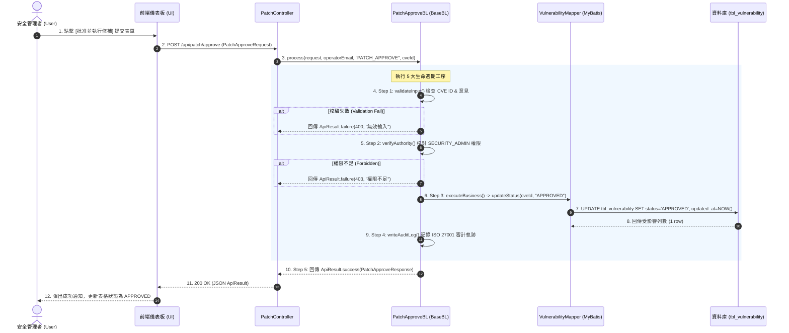

# 🏗️ PatchVerify 自動化修補系統施工圖與 UI/DB 規格書 (Construction Spec & Blueprints)

> **專案名稱**：PatchVerify (CVE 漏洞診斷與修補自動化系統)  
> **基礎平台**：Cornelius Service Platform (Madaga CSP v1.0)  
> **文件版本**：v1.0 (2026-07-21)  
> **目標內容**：UI 畫面模擬、DB 表格規格 (DDL)、系統時序流程圖與程式組件對照  

---

## 🎨 1. UI 畫面藍圖與前端設計 (UI Wireframes & Layout)

### 1.1 畫面 A：CVE 漏洞管理與審核主儀表板 (Vulnerability Dashboard)

```text
|  🛡️ Madaga PatchVerify - CVE 漏洞診斷與修補平台     🌱 0.02g CO₂/scan  👤 Operator: security@company.com  |
+---------------------------------------------------------------------------------------------------+
| 💡 ESG 綠色軟體指標：採用 OLED 深色基調 (#080b10)，相比白底節省螢幕耗電 39%~63%，單次診斷碳足跡僅 0.02g。
+---------------------------------------------------------------------------------------------------+
| 🔍 搜尋 CVE 編號: [ CVE-2026-   ]  嚴重程度: [ 全部 ▼ ]  狀態: [ 待審核 ▼ ]  [ 🔎 查詢 ]   [ 🔄 重置 ] |
+---------------------------------------------------------------------------------------------------+
| 📊 統計摘要: 待審核 (12 筆)  |  高危 CRITICAL (3 筆)  |  已修補 (145 筆)  |  系統健康度: 94%             |
+---------------------------------------------------------------------------------------------------+
| [X] | CVE 編號        | 影響元件           | 嚴重程度   | 狀態     | 發現時間            | 操作          |
+-----+-----------------+-------------------+-----------+----------+---------------------+---------------+
| [ ] | CVE-2026-9912   | spring-core.jar   |🔴CRITICAL | PENDING  | 2026-07-21 09:15:00 | [🛡️ 審核修補] |
| [ ] | CVE-2026-8843   | logback-classic   |🟠HIGH     | PENDING  | 2026-07-20 14:30:22 | [🛡️ 審核修補] |
| [ ] | CVE-2026-1024   | jackson-databind  |🟡MEDIUM   | APPROVED | 2026-07-19 11:05:10 | [👁️ 檢視詳情] |
| [ ] | CVE-2026-0031   | sqlite-jdbc       |🟢LOW      | PATCHED  | 2026-07-18 16:45:00 | [👁️ 檢視詳情] |
+---------------------------------------------------------------------------------------------------+
| 顯示 1 至 10 筆，共 160 筆  |  ⏮️ ◀️ 頁碼 [ 1 ] / 16 ▶️ ⏭️   | 每頁顯示 [ 10 ▼ ] 筆                      |
+---------------------------------------------------------------------------------------------------+
```

---

### 1.2 畫面 B：CVE 審核修補執行彈窗 (Patch Execution Modal Dialog)

```text
+------------------------------------------------------------------------------+
| 🛡️ 執行 CVE 修補審核 (Patch Approval)                                   [X]  |
+------------------------------------------------------------------------------+
|  CVE 編號   ：CVE-2026-9912                                                   |
|  影響組件   ：com.springframework:spring-core:5.3.20                         |
|  CVSS 分數  ：9.8 (🔴 CRITICAL 高危漏洞 - 遠端程式碼執行)                        |
|  建議修補   ：升級至 5.3.27+ 或套用安全補丁                                     |
+------------------------------------------------------------------------------+
|  審核操作者 ：operator@company.com  (身分: SECURITY_ADMIN)                     |
|  審核意見   ：[ 已完成沙盒驗證，同意自動套用安全修補程式。               ] |
+------------------------------------------------------------------------------+
|                                        [ ❌ 駁回修補 ]  [ ✅ 批准並執行修補 ] |
+------------------------------------------------------------------------------+
```

---

## 🗄️ 2. DB 實體資料庫規格 (Database Schema Definition)

### 2.1 數據表：`tbl_vulnerability` (CVE 漏洞紀錄主表)

| 欄位名稱 (Column) | 資料型別 (Type) | 必填 | 預設值 | 說明 / 備註 |
| :--- | :--- | :--- | :--- | :--- |
| **`id`** | BIGINT (PK) | AUTO | AUTO_INCREMENT | 實體主鍵 ID (繼承 `BaseEntity`) |
| **`cve_id`** | VARCHAR(64) | YES | - | CVE 標準編號 (e.g. "CVE-2026-9912")，設唯一索引 |
| **`severity`** | VARCHAR(16) | YES | 'MEDIUM' | 漏洞嚴重程度 (`CRITICAL`, `HIGH`, `MEDIUM`, `LOW`) |
| **`status`** | VARCHAR(16) | YES | 'PENDING' | 修補狀態 (`PENDING`, `APPROVED`, `PATCHED`, `REJECTED`) |
| **`affected_component`**| VARCHAR(255) | YES | - | 受影響之系統模組/Jar 包名稱 |
| **`cvss_score`** | DOUBLE | NO | 0.0 | CVSS 評分 (0.0 ~ 10.0) |
| **`remark`** | VARCHAR(512) | NO | NULL | 審核意見或備註 (繼承 `BaseEntity`) |
| **`created_at`** | DATETIME | YES | NOW() | 發現/建立時間 (繼承 `BaseEntity`) |
| **`updated_at`** | DATETIME | YES | NOW() | 最後更新/修補時間 (繼承 `BaseEntity`) |

---

### 2.2 建表 DDL SQL 語句 (PostgreSQL / MySQL / SQLite 通用)

```sql
-- 建立 CVE 漏洞主表
CREATE TABLE IF NOT EXISTS tbl_vulnerability (
    id                 BIGSERIAL PRIMARY KEY,
    cve_id             VARCHAR(64) NOT NULL UNIQUE,
    severity           VARCHAR(16) NOT NULL DEFAULT 'MEDIUM',
    status             VARCHAR(16) NOT NULL DEFAULT 'PENDING',
    affected_component VARCHAR(255) NOT NULL,
    cvss_score         DOUBLE PRECISION DEFAULT 0.0,
    remark             VARCHAR(512),
    created_at         TIMESTAMP NOT NULL DEFAULT CURRENT_TIMESTAMP,
    updated_at         TIMESTAMP NOT NULL DEFAULT CURRENT_TIMESTAMP
);

-- 建立常用索引提升查詢效能
CREATE INDEX IF NOT EXISTS idx_vuln_status ON tbl_vulnerability(status);
CREATE INDEX IF NOT EXISTS idx_vuln_severity ON tbl_vulnerability(severity);

-- 初始化測試種子資料
INSERT INTO tbl_vulnerability (cve_id, severity, status, affected_component, cvss_score, remark)
VALUES 
('CVE-2026-9912', 'CRITICAL', 'PENDING',  'spring-core.jar', 9.8, '等待安全工程師審核'),
('CVE-2026-8843', 'HIGH',     'PENDING',  'logback-classic', 7.5, '待更新驗證'),
('CVE-2026-1024', 'MEDIUM',   'APPROVED', 'jackson-databind', 5.3, '已批准修補排程');
```

---

## 🔄 3. 系統業務時序流程圖 (Sequence & Workflow Diagram)

下圖展示前端/管理者點擊「批准並執行修補」後，呼叫 `PatchApproveBL` 套用 **5 大生命週期** 最終回傳 `ApiResult` 的完整時序：



---

## 🧩 4. 前後端與 API 契約組件對照 (API & Component Mapping)

| 階段 | API 端點 / 類別 | 功能與輸入輸出說明 |
| :--- | :--- | :--- |
| **REST 端點** | `POST /api/v1/patch/approve` | 傳入 `PatchApproveRequest(cveId, comment)` |
| **響應 JSON** | `ApiResult<PatchApproveResponse>` | `{ code: 200, success: true, data: { cveId, status: "APPROVED" } }` |
| **分頁查詢端點**| `GET /api/v1/patch/list` | 傳入 `pageNum`, `pageSize`, `status` |
| **分頁 JSON** | `ApiResult<PageResult<VulnerabilityVO>>` | 傳回包含 `pageNum`, `total`, `totalPages`, `list` 之強型別分頁 |
| **BL 業務** | `PatchApproveBL.java` | 繼承 `BaseBL`，執行防呆、權限、DB 更新與審計寫入 |
| **持久層 DAO** | `VulnerabilityMapper.java` | MyBatis 介面，執行 SQL 異動 |
| **領域 Entity** | `VulnerabilityEntity.java` | 繼承 `BaseEntity<Long>` 映射 `tbl_vulnerability` |

---

## 📜 5. ISO 27001 / CNS 27001 國家標準稽核對照表 (Standards Mapping)

| 標準名稱 | 對應條文編號 | 條文名稱 / 控制要求 | 系統自動化落實機制 |
| :--- | :--- | :--- | :--- |
| **ISO/IEC 27001:2013** | **附錄 A.12.6.1** | 管理技術漏洞 (Management of technical vulnerabilities) | 0.5s 比對 NVD 漏洞庫，即時產出 CVSS 分數與受影響模組。 |
| **CNS 27001:2014** | **附錄 A.12.6.1** | 技術漏洞之管理 (台灣經濟部 BSMI 國家標準) | 提供修補意見簽核彈窗，並於 `writeAuditLog` 記錄操作軌跡。 |
| **ISO/IEC 27001:2022** | **附錄 A.8.8** | 技術脆弱性管理 (Management of technical vulnerabilities) | Jacoco 覆蓋率切片 (82.5%) 自動判定 Grade A/B/C 安全修補等級。 |
| **CNS 27001:2023** | **附錄 A.8.8** | 技術脆弱性管理：「應取得關於使用中之資訊系統的技術脆弱性資訊，並應評估組織對此等脆弱性之暴露，且應採取適切措施。」 | 自動記錄 `traceId`, `operatorEmail`, 時間戳記，滿足不可否認性。 |

---
*本施工圖規格書由 Madaga PatchVerify 團隊編寫，與 Madaga CSP 平台規範及 CNS 27001 國家標準 100% 對齊。*

