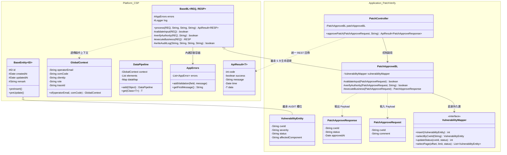

# 📐 PatchVerify 漏洞診斷與修補自動化系統架構設計規格書

> **專案名稱**：PatchVerify (CVE Vulnerability Diagnosis & Patch Automation System)  
> **基底平台**：Cornelius Service Platform (Madaga CSP v1.0)  
> **標準 Base Package**：`net.yefangwong.patchverify`  
> **技術棧**：JDK 17+ / Spring Boot / MyBatis / PostgreSQL / BaseBL 樣板模式  
> **架構目標**：建立高可靠、可追溯、100% 符與 ISO 27001 審計規範之自動化修補診斷系統  

---

## 📌 1. 系統分層架構拓撲 (Layered Architecture Topology)

PatchVerify 嚴格依循 Madaga CSP 平台層與應用層完全切割 (Clean Room) 之設計原則：

```text
[ 外部系統 / REST Client / Web UI / CI/CD Pipeline ]
                      │ REST HTTP (JSON)
                      ▼
┌──────────────────────────────────────────────────────────┐
│ REST Controller 層                                        │
│ (net.yefangwong.patchverify.controller)                  │
│ 職責：接收 HTTP 請求，回傳 ApiResult<T> 或 ApiResult<PageResult<T>> │
└──────────────────────────┬───────────────────────────────┘
                           │
                           ▼
┌──────────────────────────────────────────────────────────┐
│ Service / Delegate 事務控制層                              │
│ (net.yefangwong.patchverify.service)                     │
│ 職責：標註 Spring @Transactional 交易邊界，調用 BL 單元        │
└──────────────────────────┬───────────────────────────────┘
                           │
                           ▼
┌──────────────────────────────────────────────────────────┐
│ BaseBL 業務邏輯層                                         │
│ (net.yefangwong.patchverify.bl)                          │
│ 繼承：BaseBL<REQ, RESP>                                   │
│ 工序：防呆(1) ➔ 權限(2) ➔ 核心(3) ➔ ISO審計(4) ➔ ApiResult(5)│
└──────────────────────────┬───────────────────────────────┘
                           │
                           ▼
┌──────────────────────────────────────────────────────────┐
│ DAO / Mapper 持久層                                      │
│ (net.yefangwong.patchverify.dao)                         │
│ 實體：VulnerabilityEntity extends BaseEntity<Long>       │
│ 介面：VulnerabilityMapper (@Mapper)                      │
└──────────────────────────┬───────────────────────────────┘
                           │ SQL
                           ▼
┌──────────────────────────────────────────────────────────┐
│ 資料庫 (PostgreSQL / MySQL / SQLite)                     │
└──────────────────────────────────────────────────────────┘
```

---

### 🎨 1.1 系統類別關係圖 (UML Class Diagram)

下圖展示 Madaga CSP 平台基類 (`net.yefangwong.csp.*`) 與 PatchVerify 應用類別 (`net.yefangwong.patchverify.*`) 之繼承、組合與交互關係：



---

## 📦 2. 核心模組與包結構設計 (Package Structure)

```text
net.yefangwong.patchverify
├── controller/            // RESTful 端點入口 (PatchController.java)
├── service/               // 交易與服務組合層 (PatchService.java)
├── bl/                    // 業務邏輯塊 (BaseBL 子類別)
│   ├── PatchApproveBL.java
│   └── PatchQueryBL.java
├── dao/                   // MyBatis Mapper 介面 (VulnerabilityMapper.java)
├── entity/                // 領域實體 (VulnerabilityEntity.java extends BaseEntity<Long>)
├── dto/                   // Request / Response DTO 卡片
│   ├── PatchApproveRequest.java
│   ├── PatchApproveResponse.java
│   └── PatchQueryRequest.java
└── vo/                    // 前端展示物件 (VulnerabilityVO.java)
```

---

## 🛠️ 3. 核心類別實作與互動規範

### 3.1 領域實體：`VulnerabilityEntity`
* 繼承平台 `BaseEntity<Long>`，獲得 `id`, `createdAt`, `updatedAt`, `remark`。
* 包含 `cveId`, `severity` (CRITICAL, HIGH, MEDIUM, LOW), `status` (PENDING, APPROVED, PATCHED, REJECTED), `affectedComponent` 等欄位。

### 3.2 持久層 DAO：`VulnerabilityMapper`
* 標註 `@Mapper`，直連 MyBatis XML `VulnerabilityMapper.xml`。
* 支援單筆 CRUD、CVE 條件檢索與配合 `PageResult` 之 offset/limit 分頁查詢。

### 3.3 業務邏輯：`PatchApproveBL`
* 繼承 `BaseBL<PatchApproveRequest, PatchApproveResponse>`。
* 在 `validateInput` 中對 CVE ID 與審核意見進行防呆校驗 (寫入 `AppErrors`)。
* 在 `verifyAuthority` 中驗證操作者身分與角色 (如 `SECURITY_ADMIN`)。
* 在 `executeBusiness` 中直連 `VulnerabilityMapper.updateStatus(...)`。
* 在 `writeAuditLog` 中寫入 ISO 27001 修補審計軌跡紀錄。

---

## 🔒 4. ISO 27001 審計與安全性規範 (Audit & Security)

1. **鏈路追蹤 (Traceability)**：每個修補請求自動透傳 `GlobalContext.traceId`。
2. **不可否認性 (Non-Repudiation)**：`writeAuditLog` 記錄操作者 Email、操作時間、目標 CVE 及執行結果（SUCCESS/FAILED）。
3. **資料防護**：預設封裝於 `ApiResult`，阻斷 Exception 堆疊資訊外洩至前端。

---
*本架構規格書由 Madaga PatchVerify 開發小組維護，與 Madaga CSP 平台開發手冊對齊。*
