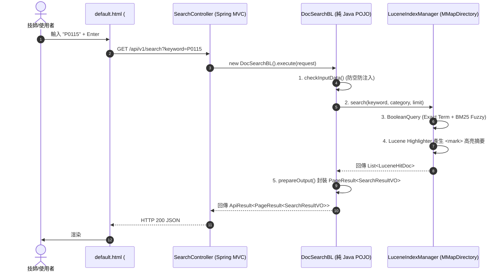

# 📐 功能規格書 (Functional Specification)
## 節點編號：FS_S1_N01_embedded_lucene_search
### 需求綁定：[[Projects/startup/madaga/BRD.md#35-brd-csp-srch-001-技師手冊與全站文件-lucene-9-嵌入式檢索原型-embedded-lucene-technical-doc-search|BRD-CSP-SRCH-001: 技師手冊與全站文件 Lucene 9 嵌入式檢索原型]]

> **所屬泳道**：S1 (前端互動與端點介接 / UI & REST Layer)  
> **關聯泳道**：S2 (開源潔淨室業務邏輯層 / BL Layer), S3 (嵌入式 Lucene 儲存層 / Engine Layer)  
> **發布日期**：2026-10-03  
> **維護人員**：Madaga CSP 架構小組  
> **狀態**：READY_FOR_IMPLEMENTATION

---

## 📌 1. 業務場景與前置/後置條件 (Context & Conditions)

### 1.1 使用者場景
保修廠現場技師（或服務廠長/管理員）在 `csp-portal-web` 後台首頁 Dashboard 頂部搜尋框輸入車輛故障代碼（如 `P0115`）、零件料號（如 `ME223120`）或常見故障現象（如 `煞車抖動`、`黑油`、`白煙`），前端即時發送非同步查詢，系統自地端內嵌之 Lucene 9 索引庫中秒級檢索出對應手冊章節、SOP 步驟與實體 PDF 頁碼，並高亮標示關鍵字。

### 1.2 前置條件 (Pre-conditions)
1. 伺服器本機儲存目錄（如 `data/docs/` 或 `classpath:docs/`）已置放技師維修手冊或規格文件 PDF。
2. 系統啟動時（或管理員觸發重建索引時），`LuceneIndexManager` 已完成 PDF 文本抽取與段索引建立。

### 1.3 後置條件 (Post-conditions)
1. 檢索端點回傳結構化 JSON，命中清單包含標題、分類、章節、頁碼、高亮摘要與評分。
2. 前端以懸浮下拉卡片或 Modal 呈現，點擊可直接跳轉至手冊章節或觸發 PDF 頁碼預覽。

---

## 🌐 2. API 介面規格 (REST Interface)

* **HTTP Method**: `GET`
* **Endpoint URL**: `/api/v1/search`
* **授權要求**: `isAuthenticated()` (所有已登入之 `ROLE_ADMIN`, `ROLE_MANAGER`, `ROLE_EMPLOYEE` 皆可使用)

### 2.1 請求參數 (Query Parameters)
| 參數名稱 | 型別 | 必填 | 說明 | 範例值 |
| :--- | :--- | :---: | :--- | :--- |
| `keyword` | `String` | 是 | 搜尋關鍵字（故障碼/零件號/現象） | `P0115` 或 `冷卻水溫` |
| `category` | `String` | 否 | 手冊分類過濾（車型/模組） | `FUSO_CANTER_5T` |
| `pageNum` | `Integer`| 否 | 當前頁碼（預設 1） | `1` |
| `pageSize` | `Integer`| 否 | 每頁回傳筆數（預設 10，上限 50） | `10` |

### 2.2 響應 JSON 規格 (Response Payload)
```json
{
  "code": 200,
  "msg": "SUCCESS",
  "time": "2026-10-03T21:18:00.000+08:00",
  "data": {
    "pageNum": 1,
    "pageSize": 10,
    "total": 3,
    "totalPages": 1,
    "list": [
      {
        "docId": "DOC-FUSO-ENG-001",
        "title": "FUSO Canter 4P10 柴油引擎維修手冊",
        "category": "引擎與冷卻系統",
        "chapter": "第 14 章：冷卻水溫感應器 (P0115/P0118) 故障排除",
        "pageNumber": 142,
        "highlightSnippet": "...當 ECU 偵測到 <mark class=\"cui-highlight\">P0115</mark> 故障代碼時，應量測端子 Pin 1 與 Pin 2 間阻抗...",
        "score": 4.85
      }
    ]
  }
}
```

---

## 🏛️ 3. 核心類別職責與循序流 (Architecture & Class Responsibilities)

遵照開源潔淨室規範與 PureMVC 架構，各層職責分明：



---

## 💾 4. 嵌入式 Lucene 索引結構設計 (Lucene Schema Design)

* **Directory 實作**：`FSDirectory.open(Paths.get("data/lucene_index"))`（底層自動採用 `MMapDirectory` 達成 0 拷貝虛擬記憶體讀取）。
* **分詞器 (Analyzer)**：`SmartChineseAnalyzer` (或 `StandardAnalyzer`)，兼顧英文代碼（`P0115`, `ME223120`）與中文繁簡關鍵字。

| 欄位名稱 (Field) | 欄位型別 (Lucene Field Type) | 存儲 (Stored) | 索引分析 (Indexed/Analyzed) | 用途 |
| :--- | :--- | :---: | :---: | :--- |
| `docId` | `StringField` | YES | NO (精確單詞) | 手冊文件唯一識別碼 |
| `title` | `TextField` | YES | YES (分詞索引) | 手冊主標題 |
| `category` | `StringField` | YES | NO (精確單詞) | 車型/系統分組過濾標籤 |
| `chapter` | `TextField` | YES | YES (分詞索引) | 章節名稱 |
| `pageNumber`| `StoredField` / `IntPoint` | YES | YES (數值點) | 實體手冊頁碼 |
| `content` | `TextField` | NO (或 YES) | YES (全文分詞) | 手冊本文內容（用於全文比對與高亮） |
| `exactCode`| `StringField` (多值) | YES | NO (精確單詞) | 提取出的料號、故障代碼 (Exact Filter) |

---

## 🎨 5. 前端 UI 互動與 CSS 規範 (Front-End Interaction)

1. **搜尋框綁定**：
   - 桌面版：[`#globalSearchInput`](file:///Users/yefangwong/Documents/GitHub.nosync/madaga/csp/csp-portal-web/src/main/resources/templates/layout/default.html#L107)
   - 手機版：[`#mobileSearchInput`](file:///Users/yefangwong/Documents/GitHub.nosync/madaga/csp/csp-portal-web/src/main/resources/templates/layout/default.html#L121)
2. **高亮樣式規範 (`cornelius-ui.css`)**：
   ```css
   mark.cui-highlight {
       background-color: #fef08a; /* 醒目柔和黃色 */
       color: #854d0e;
       font-weight: 600;
       padding: 0 3px;
       border-radius: 4px;
   }
   ```
3. **結果卡片呈現**：
   - 顯示手冊名稱、所屬章節標籤、實體手冊頁碼標籤（例如：`第 142 頁`）。
   - 點擊「查看手冊」按鈕時，可呼叫 PDF 檢視器跳轉至指定頁碼。

---

## 🛡️ 6. 測試驗收標準 (Acceptance Test Checklist)

1. **[TEST-01] 單元測試 (`DocSearchBLTest`)**：
   - 空關鍵字查詢防呆拋錯（HTTP 400）。
   - 特殊符號防注入測試。
   - 模擬 LuceneHitDoc 轉換為 `PageResult` 格式正確。
2. **[TEST-02] 索引整合測試 (`LuceneIndexManagerTest`)**：
   - 寫入 100 筆模擬故障手冊文件。
   - 精確搜尋 `P0115`，命中第 1 名評分最高且耗時 $< 15\text{ms}$。
   - 驗證 `<mark class="cui-highlight">` 高亮標籤正確嵌入。
3. **[TEST-03] P3C 規約掃描**：零重大/強制違規。

---
## Sources
- [[Projects/startup/madaga/BRD.md]] (`BRD-CSP-SRCH-001`)
- [[AI_Raw/solutions/madaga_csp_portal_lucene_pdf_search.md]]
- [[facts/cornelius_clean_room_unit_of_work_and_tx_submitter_pattern.md]]
