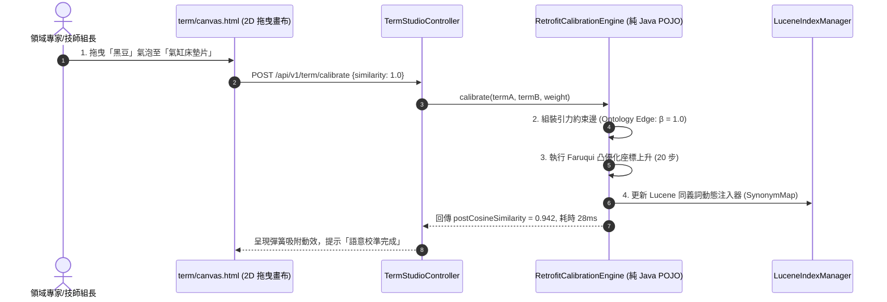

# 📐 功能規格書 (Functional Specification)
## 節點編號：FS_S1_N03_semantic_canvas_studio
### 需求綁定：[[Projects/startup/madaga/BRD.md#37-brd-csp-srch-003-私域術語定義與語意引力畫布-semantic-canvas--termalign-studio|BRD-CSP-SRCH-003: 私域術語定義與語意引力畫布 (Semantic Canvas & TermAlign Studio)]]

> **所屬泳道**：S1 (術語畫布前端互動 / Canvas UI Layer)  
> **關聯泳道**：S2 (Faruqui 凸優化流形微調引擎 / Neurosymbolic Engine Layer)  
> **發布日期**：2026-10-03  
> **維護人員**：Madaga CSP 架構小組  
> **狀態**：READY_FOR_IMPLEMENTATION

---

## 📌 1. 業務場景與前置/後置條件 (Context & Conditions)

### 1.1 使用者場景
保修廠現場技師或領域組長在後台介面新增黑話詞彙（例如 `黑豆`、`鳥仔蓋`）。系統提供**單軸彈性拉桿 (1D Slider)** 或 **二維四象限畫布 (2D Semantic Canvas)**。技師直接在畫布上將 `黑豆` 拖曳至 `氣缸床墊片` 泡泡旁邊，設定等價替換引力（相似度 1.0）。後端在 50ms 內透過 Faruqui 座標上升演算法微調本地詞向量與同義詞索引。當技師在搜尋框輸入「黑豆沖掉」時，系統 100% 精準命中原廠手冊之氣缸床墊片維修章節與資料庫零件庫存。

### 1.2 前置條件 (Pre-conditions)
1. 系統具備預訓練稠密詞向量基準（如 BGE 或本地詞表快取）。
2. 使用者具備 `ROLE_ADMIN` 或 `ROLE_MANAGER` 權限。

### 1.3 後置條件 (Post-conditions)
1. 產出術語引力邊矩陣並持久化存儲於 `sys_term_synonym`。
2. 本地 Embedding 向量空間完成凸優化流形正則化，同義詞庫即刻生效。

---

## 🌐 2. API 介面規格 (REST Interface)

### 2.1 儲存術語引力權重並觸發流形微調
* **Endpoint**: `POST /api/v1/term/calibrate`
* **Request Payload**:
  ```json
  {
    "termA": "黑豆",
    "termB": "氣缸床墊片",
    "mode": "2D_QUADRANT",
    "similarity": 1.0,
    "relatedness": 0.2,
    "notes": "裕益保修廠引擎維修黑手俗稱"
  }
  ```
* **Response Payload**:
  ```json
  {
    "code": 200,
    "msg": "CALIBRATION_SUCCESS",
    "data": {
      "calibratedIterations": 20,
      "elapsedMs": 28,
      "postCosineSimilarity": 0.942,
      "status": "ACTIVE"
    }
  }
  ```

---

## 🏛️ 3. 核心類別職責與循序流 (Architecture & Class Responsibilities)



---

## 🎨 4. 前端二維語意四象限畫布規範 (2D Canvas Spec)

1. **坐標系劃分**：
   - **X 軸（橫軸）**：概念相似性 (Similarity / Is-A)，範圍從 $-1.0$ (反義) 至 $+1.0$ (同義)。
   - **Y 軸（縱軸）**：語境關聯性 (Relatedness / Has-A)，範圍從 $0.0$ (無關) 至 $+1.0$ (高頻共現)。
2. **視覺動效**：
   - 節點採用圓形泡泡，標準零件詞為深色（`#1e293b`），自定義黑話詞為琥珀色（`#d97706`）。
   - 拖曳靠近時，兩者之間顯示具備張力動效之引力彈簧線（帶有阻尼振盪），釋放時自動磁吸。

---

## 🛡️ 5. 測試驗收標準 (Acceptance Test Checklist)

1. **[TEST-01] 凸優化座標上升演算法單元測試 (`RetrofitCalibrationEngineTest`)**：
   - 驗證 20 步座標上升耗時 $\le 50\text{ms}$。
   - 驗證兩詞初始餘弦值（$0.55$）在校準後提升至 $\ge 0.90$。
2. **[TEST-02] 檢索命中率驗證**：
   - 以黑話「黑豆」搜尋手冊，第 1 名命中結果必須為「氣缸床墊片維修指引」。
3. **[TEST-03] P3C 規約掃描**：零重大/強制違規。

---
## Sources
- [[Projects/startup/madaga/BRD.md]] (`BRD-CSP-SRCH-003`)
- [[facts/discovery_tree_token_semantics_and_guided_generation.md]]
- [[facts/faruqui_2015_retrofitting_word_vectors_to_semantic_lexicons.md]]
