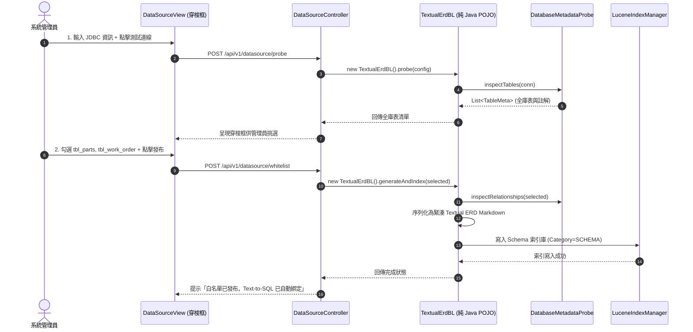

# 📐 功能規格書 (Functional Specification)
## 節點編號：FS_S2_N02_textual_erd_whitelist
### 需求綁定：[[Projects/startup/madaga/BRD.md#36-brd-csp-srch-002-多資料庫連線探針與文字化-erd-白名單治理-dynamic-datasource--textual-erd-whitelist|BRD-CSP-SRCH-002: 多資料庫連線探針與文字化 ERD 白名單治理]]

> **所屬泳道**：S2 (資料治理與文字化 ERD 引擎 / Schema Governance Layer)  
> **關聯泳道**：S1 (後台配置介面 / Admin UI), S3 (嵌入式 Lucene 儲存層 / Engine Layer)  
> **發布日期**：2026-10-03  
> **維護人員**：Madaga CSP 架構小組  
> **狀態**：READY_FOR_IMPLEMENTATION

---

## 📌 1. 業務場景與前置/後置條件 (Context & Conditions)

### 1.1 使用者場景
企業系統管理員在 `csp-portal-web` 後台新增一個資料庫連線（例如：MySQL 或 AS400 同步庫），點擊「測試連線」驗證連通後，系統自動抓取全庫資料表。管理員透過穿梭框勾選需要對 AI 開放的 5~10 張業務表（如 `tbl_parts`, `tbl_work_order`）。系統自動將勾選之資料表實體、主外鍵關聯 (PK/FK) 與欄位註解序列化為極簡的「文字化 ERD」，並寫入 Lucene 9 索引庫，供 Text-to-SQL 動態 Schema 尋路使用。

### 1.2 前置條件 (Pre-conditions)
1. 外部資料庫伺服器具備合法的 JDBC 訪問網路權限與帳號密碼。
2. 管理員具備 `ROLE_ADMIN` 最高權限。

### 1.3 後置條件 (Post-conditions)
1. 勾選的資料表被標記為白名單，未勾選表（薪資、密碼表）強制遮蔽。
2. 產出文字化 ERD 文本並寫入本地 Lucene Schema 索引庫。
3. `Synthesizer` 收到自然語言時，動態調用此索引庫注入正確 Schema。

---

## 🌐 2. API 介面規格 (REST Interface)

### 2.1 測試並探針資料庫端點
* **Endpoint**: `POST /api/v1/datasource/probe`
* **Request Payload**:
  ```json
  {
    "name": "裕益汽車保修庫",
    "driverClassName": "com.mysql.cj.jdbc.Driver",
    "jdbcUrl": "jdbc:mysql://localhost:3306/yuyih_db?useSSL=false&serverTimezone=UTC",
    "username": "app_user",
    "password": "encrypted_password"
  }
  ```
* **Response Payload (回傳全庫探針結果)**:
  ```json
  {
    "code": 200,
    "msg": "SUCCESS",
    "data": {
      "connected": true,
      "tables": [
        { "tableName": "tbl_parts", "remarks": "車輛零件主表", "columnCount": 12 },
        { "tableName": "tbl_work_order", "remarks": "保修工單主表", "columnCount": 18 },
        { "tableName": "sys_user", "remarks": "系統使用者表", "columnCount": 8 }
      ]
    }
  }
  ```

### 2.2 儲存白名單並生成文字化 ERD 端點
* **Endpoint**: `POST /api/v1/datasource/whitelist`
* **Request Payload**:
  ```json
  {
    "datasourceId": "DS-001",
    "selectedTables": ["tbl_parts", "tbl_work_order"]
  }
  ```
* **Response Payload**:
  ```json
  {
    "code": 200,
    "msg": "SUCCESS",
    "data": {
      "textualErd": "[TABLE: tbl_parts (車輛零件主表)]\n- part_id(PK, int): 序號\n- part_no(UK, varchar): 原廠料號\n- name(varchar): 零件名稱\n[TABLE: tbl_work_order (保修工單主表)]\n- order_id(PK, varchar): 工單號\n- part_id(FK, int): 零件序號\n[RELATIONSHIPS]\n- tbl_work_order.part_id >-- tbl_parts.part_id\n",
      "indexedDocCount": 2,
      "elapsedMs": 12
    }
  }
  ```

---

## 🏛️ 3. 核心類別職責與循序流 (Architecture & Class Responsibilities)



---

## 💾 4. 文字化 ERD (Textual ERD) 語法規格

序列化產物必須遵守極簡 EBNF 規範，兼具高語意密度與超低 Token 開銷：
```text
[TABLE: {tableName} ({tableRemarks})]
- {colName}({PK|FK|UK|NONE}, {colType}): {colRemarks} [別名: {synonyms}]
...
[RELATIONSHIPS]
- {sourceTable}.{sourceCol} >-- {targetTable}.{targetCol}
```

---

## 🛡️ 5. 測試驗收標準 (Acceptance Test Checklist)

1. **[TEST-01] JDBC 探針模擬測試 (`DataSourceProbeTest`)**：
   - 模擬 H2 / SQLite 資料庫，驗證 100% 正確獲取 Table REMARKS 與 Foreign Keys。
2. **[TEST-02] 文字化 ERD 序列化測試 (`TextualErdGeneratorTest`)**：
   - 輸入包含主外鍵之多表元數據，驗證輸出的文字化 ERD 格式正確，無多餘空行。
   - 10 張表基準下，產生之 Markdown 文本體積 $\le 3\text{KB}$。
3. **[TEST-03] Lucene 索引寫入與尋路測試**：
   - 將文字化 ERD 寫入 Lucene，搜尋關鍵字「零件料號」，命中 `tbl_parts` 耗時 $\le 5\text{ms}$。
4. **[TEST-04] P3C 規約掃描**：零重大/強制違規。

---
## Sources
- [[Projects/startup/madaga/BRD.md]] (`BRD-CSP-SRCH-002`)
- [[solutions/madaga_nlp_to_sql_governance.md]]
- [[facts/cornelius_clean_room_unit_of_work_and_tx_submitter_pattern.md]]
